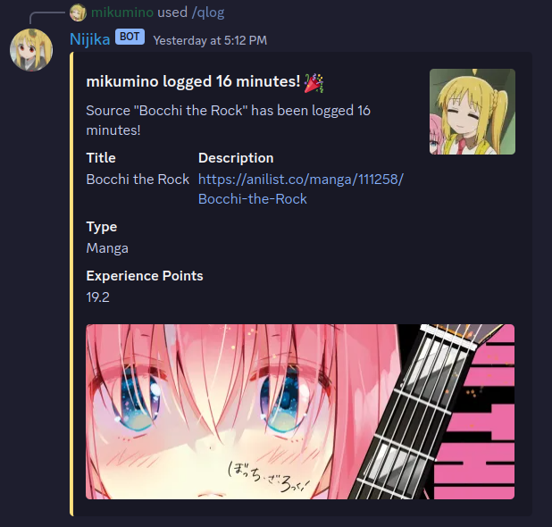
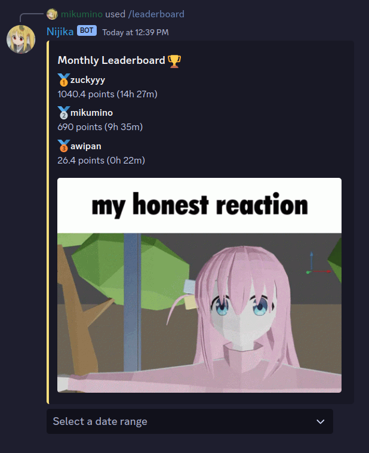
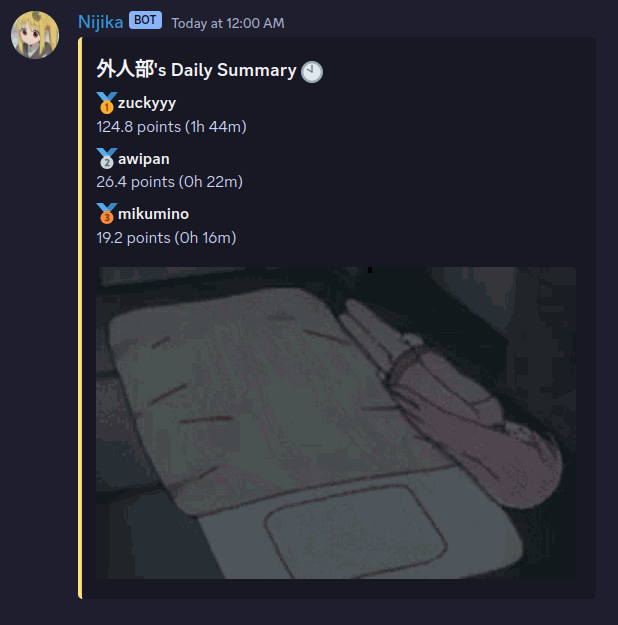
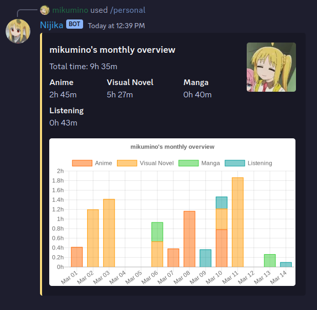
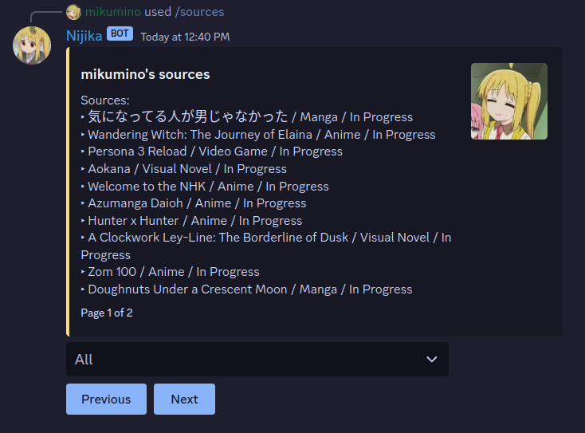
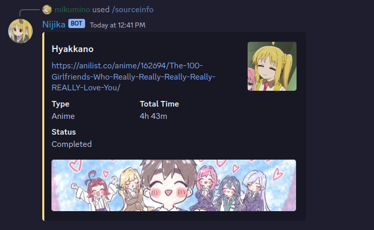

# Nijika - Immersion Tracking Discord Bot

A personal solution for my friend's server. Log immersion, get experience points, level up, and share your immersion progress with friends. Heavily inspired by TheMoeWay's immersion bot.



## 📃 Requirements

1. Discord Bot Token ([guide](https://discordjs.guide/preparations/setting-up-a-bot-application.html#creating-your-bot))
2. Node.js (tested on v18.13.0+)

## 💾 Installation

Run the following:

```
git clone https://github.com/mikumino/nijika.git
cd nijika
npm install
```

Fill appropriate fields in `example-config.json` and rename it to `config.json`. 

Deploy the commands with:

```
node deploy-commands.js
```

You can then start the bot with:

```
node index.js
```

## 🎊 Features

### 📖 Immersion tracking with /log
- Create Sources: Media sources you can repetitively log
- Log one-time media
- Gain XP from tracking, compete with friends

### 🏆 Leaderboard
- See rankings based on immersion time
- Sort by day, week, or month



### 📚 Auto Summaries
- See time and point breakdown for the day and month
- Automatic daily server-wide summaries with /toggleautoleaderboard



### 📊 Statistics
- Generate graphs of your immersion time
- Organize by week or month



### 🏃 Quick Logging
- Log media with a single command
- Autocompletes based on your sources


### 📝 Sources
- See all your sources
- Add, remove, and edit sources



### ℹ️ Source Info
- See information about a source




